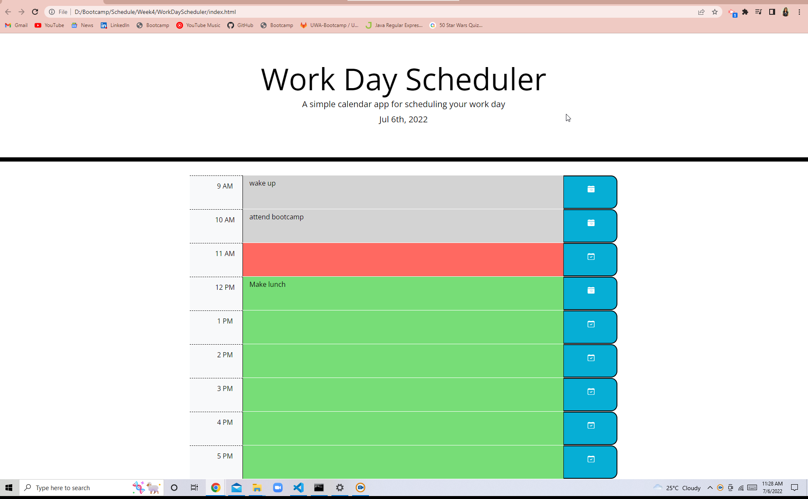

# WorkDayScheduler
A simple calendar application that allows a user to save events for each hour of the day

## Description

This is a simple calendar application that allows a user to save events for each hour of the day. This daily plnner saves your important events to help you in your busy schedules, to mnage the time efficiently.

## Features

This daily planner will help to plan your day by adding important events of your day.
The current time will be highlighted in red color whereas the past times will be in grey and for the future events the application will highlight green color for the events.
User can save or clear the events any time.

## Installation

Visit this <a href="https://akshu3011.github.io/WorkDayScheduler/"> page</a> to plan your day...

## Credits & references
<li>Akshata Kumbhar, creator</li>
<li>W3Schools, MDN, stackoverflow reference for the JS help</li>
<li>Bootstrap 4.5<li>
